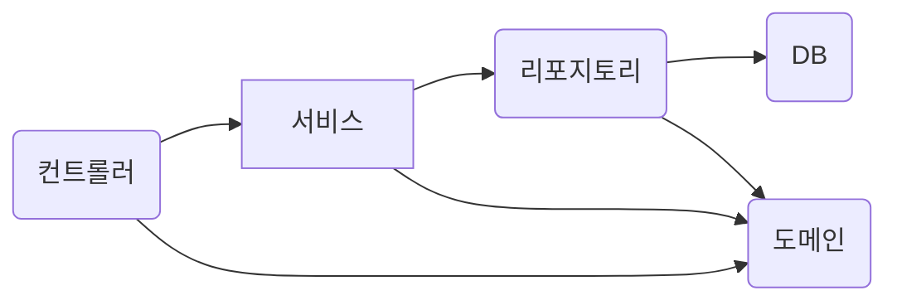
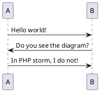

# hello-spring

Caused by: org.codehaus.groovy.control.MultipleCompilationErrorsException: startup failed:

[해결]
- Project Structure(Ctrl+Alt+Shift+S)  
  - Download JDK  
    Version: 1.8  
    Vendor: Amazon Corretto 1.8.0_282  
    Location: C:\Users\spiri\.jdks\corretto-1.8.0_282  
    Version: 11  
    Vendor: Amazon Corretto 11.0.10  
    Location: C:\Users\spiri\.jdks\corretto-11.0.10  

- Settings(Ctrl+Alt+S)  
  Build, Execution, Deployment > Build Tools > Gradle  
  
  Build and run using: IntelliJ IDEA  
  Run tests using: IntelliJ IDEA  
  
  Gradle JVM: corretto-11  

----

http://localhost:8080/
http://localhost:8080/hello
http://localhost:8080/hello-mvc?name=spring
http://localhost:8080/hello-string?name=spring
http://localhost:8080/hello-api?name=spring

----

> https://mermaid-js.github.io/mermaid/#/

### hello 프로젝트 구성
- 컨트롤러: 웹 MVC의 컨트롤러 역할
- 서비스: 핵심 비즈니스 로직 구현
- 리포지토리: 데이터베이스에 접근, 도메인 객체를 DB에 저장하고 관리
- 도메인: 비즈니스 도메인 객체, 예) 회원, 주문, 쿠폰 등등 주로 데이터베이스에 저장하고 관리됨

https://plantuml.com/ko/

